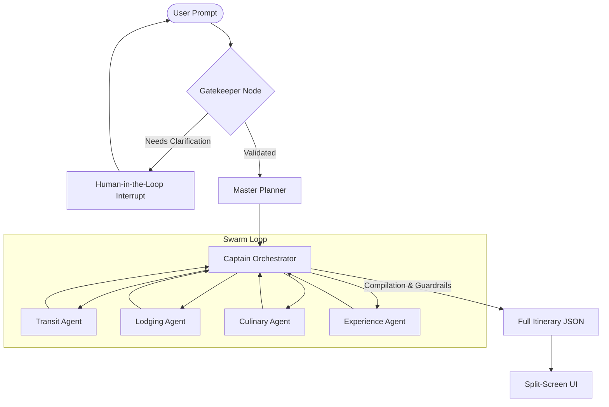

# Project Context & Memory: OdysseyAI Travel Swarm

OdysseyAI is a real-time, stateful, multi-agent travel planner built with a **Python FastAPI + LangGraph** backend and a **Next.js (App Router) + TypeScript** split-screen frontend. This document preserves the key backend data schemas, agent mechanics, and frontend design patterns for rapid context retrieval.

---

## 1. System & Backend Architecture

The backend implements a directed acyclic graph using **LangGraph** where a global `AgentState` is passed between specialized agent nodes. The orchestrator routes execution based on the state of candidate items collected during the flow.



### 1.1. Core Agents
1. **Gatekeeper** (`backend/src/agents/gatekeeper.py`):
   - Extracts parameters: `origin`, `destination`, `duration_days`, `theme`, `start_date`, `budget_level`, `travel_style`.
   - If `destination` or `duration_days` is missing, validation fails (`is_validated = False`).
   - Pauses execution using LangGraph `interrupt()`, yielding clarifying questions to the client. Upon resumption, merges answers and re-evaluates.
2. **Master Planner** (`backend/src/agents/planner.py`):
   - Breaks down regional trips into destinations and allocates days (e.g. Kerala → Kochi 1 day, Munnar 2 days).
   - Uses a ReAct loop with Google Search to fetch regional distance details before outputting allocations.
3. **Captain (Orchestrator)** (`backend/src/agents/captain.py`):
   - Evaluates active state. If candidate lists are empty, routes sequentially to subagents.
   - Once all candidates are gathered, spawns a background compilation task while streaming simulated thinking logs to keep users engaged.
   - Reconstructs the finalized day-by-day itinerary by mapping reference IDs back to candidates and runs guardrails (e.g., verifying travel distances, operating hours, budget constraints) to generate validation warnings.
4. **Subagents** (`backend/src/agents/subagents/`):
   - **Transit Agent (travel)**: Searches flights and routing segments using origin/destination/dates.
   - **Lodging Agent (stay)**: Identifies hotel candidates based on city coordinates and budget level.
   - **Culinary Agent (food)**: Sinks food/dining candidates aligning with styles.
   - **Experience Agent (sightseeing)**: Populates sights/activities.

---

## 2. Backend Data Models & State

The state and models are defined in `backend/src/graph/state.py` using Pydantic.

### 2.1. Component Models
- **Location**:
  ```python
  class Location(BaseModel):
      name: str
      address: str
      latitude: float
      longitude: float
  ```
- **Place** (Used for accommodation, food, sightseeing):
  ```python
  class Place(BaseModel):
      type: Literal["place"] = "place"
      id: str
      name: str
      category: PlaceCategory  # "food", "stay", "sightseeing"
      location: Location
      rating: Optional[float]
      cost_estimate: Optional[float]
      description: str
      photo_url: Optional[str] = None
  ```
- **TransitOption**:
  ```python
  class TransitOption(BaseModel):
      type: Literal["transit"] = "transit"
      id: str
      origin: str
      destination: str
      departure_time: Optional[str]
      arrival_time: Optional[str]
      mode: TravelMode  # flight, train, bus, car_rental, walking, driving, transit
      duration_minutes: int
      estimated_price: int
      carrier: Optional[str]
  ```
- **DayPlan** & **FullItinerary**:
  ```python
  class DayPlan(BaseModel):
      day_number: int
      date: str
      schedule: List[Union[Place, TransitOption]]

  class FullItinerary(BaseModel):
      destination: str
      duration_days: int
      theme: str
      start_date: str
      days: List[DayPlan]
  ```

### 2.2. Shared AgentState Schema
```python
class AgentState(TypedDict):
    user_prompt: str
    parsed_parameters: Dict[str, Any]
    clarification_questions: List[str]
    clarification_response: Dict[str, str]
    is_validated: bool
    planned_destinations: List[DestinationAllocation]
    transit: List[TransitOption]
    accommodation: List[Place]
    food: List[Place]
    activities: List[Place]
    final_itinerary: Optional[FullItinerary]
```

### 2.3. Server Endpoints (`backend/server.py`)
- `GET /health`: Health status.
- `POST /api/plan/run`: Starts a new session or run. Returns real-time Server-Sent Events (SSE) streaming JSON logs (`node_start`, `node_end`, `log`, `candidates_discovered`, `interrupt`, `completed`, `error`).
- `POST /api/plan/resume`: Submits clarifying question answers to resume the graph via `Command(resume=answers)`. Streams remaining execution progress.
- `GET /api/plan/session/{thread_id}`: Retrieves state and checkpoints.

---

## 3. Frontend UI Choices & Design Systems

The frontend is a highly polished, responsive split-screen React application styled using Vanilla CSS (`frontend/src/app/globals.css`).

### 3.1. Layout & Panels
- **Dual-Pane Sidebar (Left)**:
  - Toggleable via a vertical icon bar between **Pipeline** and **Map**.
  - **Pipeline View**: Custom grid background. Renders cards for each agent (`gatekeeper`, `planner`, `captain`, and subagents). Displays discovery metrics (discovered candidate counts) and active badges for their respective tools (e.g. Booking.com, TripAdvisor).
  - **Map View (Leaflet)**: Renders OpenStreetMap tiles. Displays custom neon-glowing pins for places (color-coded: stays → Blue, food → Green, sightseeing → Amber). Connects them sequentially with high-contrast dashed routing lines. Fits boundaries dynamically.
- **Console Pane (Right)**:
  - Houses the chat interaction history (collapsing consecutive agent messages by node to prevent clutter).
  - Features suggesting prompt chips (e.g. "Weekend in Delhi — budget travel") in an empty state.
  - Dynamically injects clarifying question forms inside the scrollable message stack when the backend triggers an interrupt.
  - Embeds validation warning banners (e.g. warnings about transit distances) at the footer when compilation finishes.

### 3.2. Micro-Animations & SVG Wire
- **Dynamic Laser Wire**:
  - An SVG overlay is mapped across the entire window.
  - Draws a cubic Bezier curve connecting the Gatekeeper card's socket (`#gatekeeper-plug-socket`) on the left panel to the Chat Input block (`#chat-input-plug-connector`) on the right.
  - The path uses an SVG mask (`#wire-mask`) to cut out coordinates matching the Experience Agent card, hiding the wire where it overlaps components.
  - Streams a glowing laser charge gradient (`#wire-gradient`) across the line:
    - Moves forward (Input → Gatekeeper) during validation and planning.
    - Moves in reverse (Gatekeeper → Input) once the planning reaches `completed` state.
